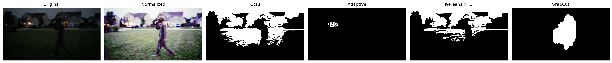

# CS898BA-Project1

## Libraries Used

- OpenCV
- NumPy
- Pandas
- SciPy
- Matplotlib

## Part 1: Image Statistics

Basic statistics were calculated for each RGB channel of the original image.

Statistics calculated:

- Minimum
- Maximum
- Mean
- Median
- Mode
- Skewness
- Range
- Standard Deviation
- Variance

Results were saved to:

```text
output/image_statistics.csv
```

### Observations

All three RGB channels showed positive skewness and moderate variation in pixel intensity values.

## Part 2: Image Processing Operations

### Grayscale Conversion

The original image was converted to grayscale.

### Binary Conversion

A threshold was applied to create a binary image.

### Color Space Conversions

The image was converted into:

- HSV
- CIELAB (LAB)
- HLS

### Histogram Equalization

Histogram equalization was performed on the V (Value) channel of the HSV image and then converted back to RGB.

### Affine Transformations

Two unique affine transformations were applied to each of the seven base images:

- Rotation
- Translation

This generated 14 transformed images.

### Gaussian Blur

Gaussian blur was applied to all 21 images using the following sigma values:

- 0.5
- 1.0
- 1.5
- 2.0
- 2.5
- 3.0
- 3.5

As the sigma value increased, the images became smoother and edge details became less visible.

This process generated a total of 168 images.

## Part 3: Edge Detection

The 168 generated images were randomly divided into four equal subsets.

Each subset contained:

```text
42 images
```

Subset 1 was selected for further analysis.

The following edge detection techniques were applied:

- Sobel
- Laplacian
- Canny
- Prewitt

Including the original input image, this produced:

```text
210 images
```

## Edge Detection Analysis

### Sobel

Advantages:

- Preserved major object boundaries
- Produced consistent results across different transformations
- Maintained useful structural information

Disadvantages:

- Some weaker edges were not detected
- Edge responses were occasionally thicker

### Laplacian

Advantages:

- Detected fine intensity changes
- Captured small image details

Disadvantages:

- More sensitive to noise
- Produced cluttered outputs in some cases

### Canny

Advantages:

- Produced thin and clean edges
- Reduced noise effectively

Disadvantages:

- Removed some useful image details
- Often produced sparse results after heavy blurring

### Prewitt

Advantages:

- Produced consistent edge maps
- Preserved major object structures

Disadvantages:

- Slightly weaker edge responses than Sobel
- Missed some finer details

### Best Performing Method

Based on the generated comparison plots, Sobel provided the most useful overall results for this image set.

Sobel consistently preserved the outline of the subject and surrounding structures while maintaining reasonable noise levels. Although Canny produced cleaner edges, it frequently removed useful information after transformations and Gaussian blurring. Laplacian introduced additional noise, while Prewitt produced similar results to Sobel but with slightly weaker edge responses.

For this image set, Sobel was selected as the best-performing edge detection method.

## Selected Comparison Plots

### Plot 1

Processing Pipeline:

HSV Equalization → Rotation (70°) → Gaussian Blur (σ = 3.0)


### Plot 2

Processing Pipeline:

Binary Image → Translation (30,15)


### Plot 3

Processing Pipeline:

Binary Image → Gaussian Blur (σ = 2.5)


### Plot 4

Processing Pipeline:

Grayscale → Rotation (20°) → Gaussian Blur (σ = 0.5)


### Plot 5

Processing Pipeline:

HLS → Rotation (60°)


### Plot 6

Processing Pipeline:

HLS → Translation (60,30) → Gaussian Blur (σ = 3.0)


## Conclusion

All required image processing operations, affine transformations, Gaussian blurring, subset generation, edge detection methods, and comparison plots were successfully completed. Based on the generated results, Sobel provided the most consistent edge detection performance for this image set.
---

## Homework Two: Image Segmentation

### Purpose

The purpose of Homework Two was to apply and evaluate classical and optimization-based image segmentation techniques to isolate the main figure from the background. This homework extended the Homework One image-processing pipeline by adding preprocessing, segmentation masks, foreground extraction, quantitative comparison, and visualization.

### Repository Maintenance

A new branch named `Feature-Segmentation` was created for Homework Two so that the Homework One code would not be overwritten. The new segmentation code was added in `hw2_segmentation.py`, and the manual reference mask workflow was added in `make_reference_mask.py`.

### Image Preprocessing and Multi-Channel Normalization

The original image was loaded from the input folder and split into its B, G, and R color channels. Histogram equalization was applied independently to each channel to improve contrast and reduce the effect of uneven lighting. The equalized channels were then merged back together to create a normalized color image.

The normalized image was saved as:

`output/hw2/normalized_equalized_color.png`

This normalized image was used as the input for all segmentation methods.

### Threshold-Based Segmentation

#### Otsu's Global Thresholding

The normalized image was converted to grayscale, and Otsu's automatic thresholding was applied. This method attempted to separate the foreground from the background using a single global threshold value.

Otsu's method was simple and fast, but it struggled because the image is dark and the figure has similar intensity values to parts of the background.

Outputs saved:

- `output/hw2/otsu_mask.png`
- `output/hw2/otsu_foreground.png`

#### Adaptive Thresholding

Adaptive Gaussian thresholding was applied to the grayscale version of the normalized image. This method calculates local threshold values, which can help with uneven lighting.

However, in this image, adaptive thresholding produced a poor result because the low lighting and background texture caused the method to miss most of the actual figure.

Outputs saved:

- `output/hw2/adaptive_mask.png`
- `output/hw2/adaptive_foreground.png`

### Classical and Optimization-Based Segmentation

#### K-Means Color-Space Clustering

The normalized image was converted to HSV color space, and K-Means clustering was tested using K values of 3, 4, and 5. The script selected the cluster that best represented the central figure.

K-Means was able to separate some color regions, but it still struggled because the figure and background have similar dark tones.

Outputs saved:

- `output/hw2/kmeans_k3_mask.png`
- `output/hw2/kmeans_k4_mask.png`
- `output/hw2/kmeans_k5_mask.png`
- `output/hw2/kmeans_k3_foreground.png`
- `output/hw2/kmeans_k4_foreground.png`
- `output/hw2/kmeans_k5_foreground.png`

#### GrabCut

GrabCut was initialized using a rectangle around the central figure. It used foreground and background estimation to refine the segmentation.

GrabCut produced the best quantitative result among the four methods. The result still included some surrounding background because the image has low contrast, dark lighting, motion blur, and background colors similar to the figure.

Outputs saved:

- `output/hw2/grabcut_mask.png`
- `output/hw2/grabcut_foreground.png`

### Evaluation and Analysis

A manual reference mask was created using `make_reference_mask.py`. This reference mask served as the pseudo-ground truth for evaluating the segmentation methods.

The segmentation masks were compared using:

- Intersection over Union / Jaccard Index
- Dice Coefficient

### Quantitative Comparison

| Method | IoU / Jaccard Index | Dice Coefficient |
|---|---:|---:|
| Otsu | 0.0105 | 0.0209 |
| Adaptive | 0.0000 | 0.0000 |
| K-Means K=3 | 0.0119 | 0.0235 |
| GrabCut | 0.3925 | 0.5637 |

### Qualitative Analysis

The quantitative results show that GrabCut performed better than the other segmentation methods for this image. Otsu's thresholding and K-Means clustering produced very low overlap with the manual reference mask. Adaptive thresholding had the weakest result because it failed to isolate the figure from the dark background.

The low metric values for Otsu, Adaptive Thresholding, and K-Means are mainly due to the challenging image conditions. The figure is dark, partially blurred, and visually similar to the background. The houses, grass, shadows, and low-light regions make foreground-background separation difficult for classical segmentation methods.

Multi-channel histogram equalization improved the contrast of the image, but it also increased some background texture. This helped some methods slightly while also making parts of the background more noticeable. Overall, the segmentation task was difficult, and the results show the limitations of classical segmentation methods on low-light outdoor images.

### Visualization

The figure below shows the original image, the normalized image, and the final segmentation masks from Otsu, Adaptive Thresholding, K-Means, and GrabCut.



### Output Files

The main Homework Two outputs are:

- `output/hw2/original.png`
- `output/hw2/normalized_equalized_color.png`
- `output/hw2/otsu_mask.png`
- `output/hw2/otsu_foreground.png`
- `output/hw2/adaptive_mask.png`
- `output/hw2/adaptive_foreground.png`
- `output/hw2/kmeans_k3_mask.png`
- `output/hw2/kmeans_k3_foreground.png`
- `output/hw2/kmeans_k4_mask.png`
- `output/hw2/kmeans_k4_foreground.png`
- `output/hw2/kmeans_k5_mask.png`
- `output/hw2/kmeans_k5_foreground.png`
- `output/hw2/grabcut_mask.png`
- `output/hw2/grabcut_foreground.png`
- `output/hw2/reference_mask.png`
- `output/hw2/metrics.csv`
- `README_images/hw2_comparison.png`

