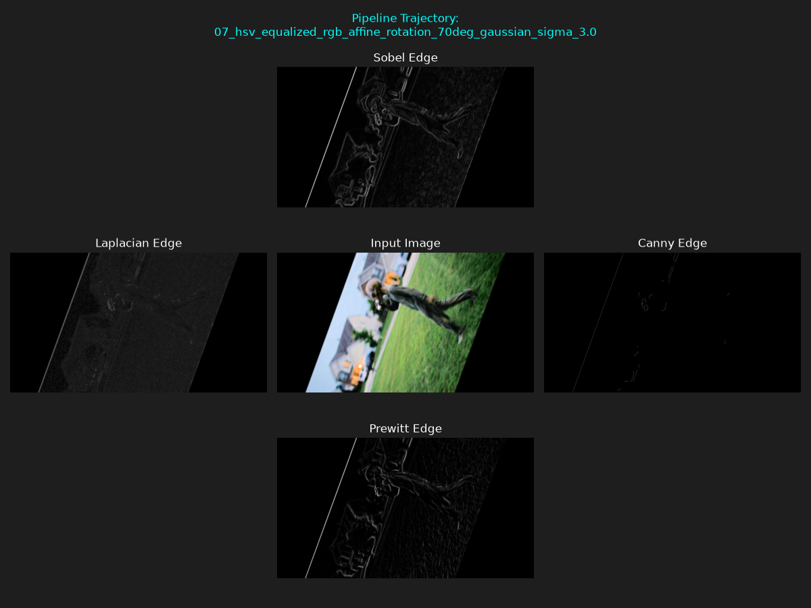
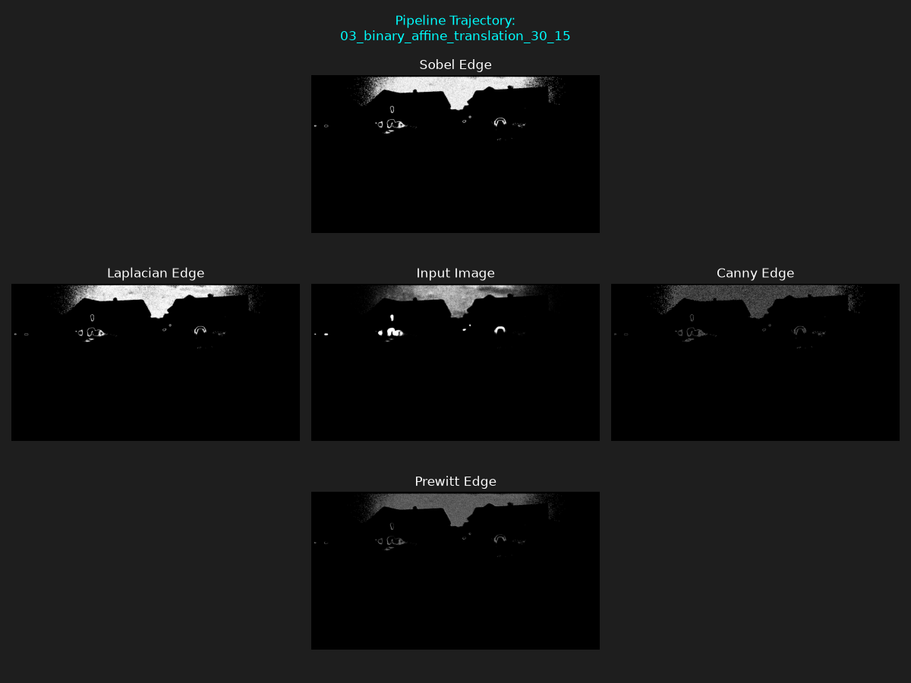
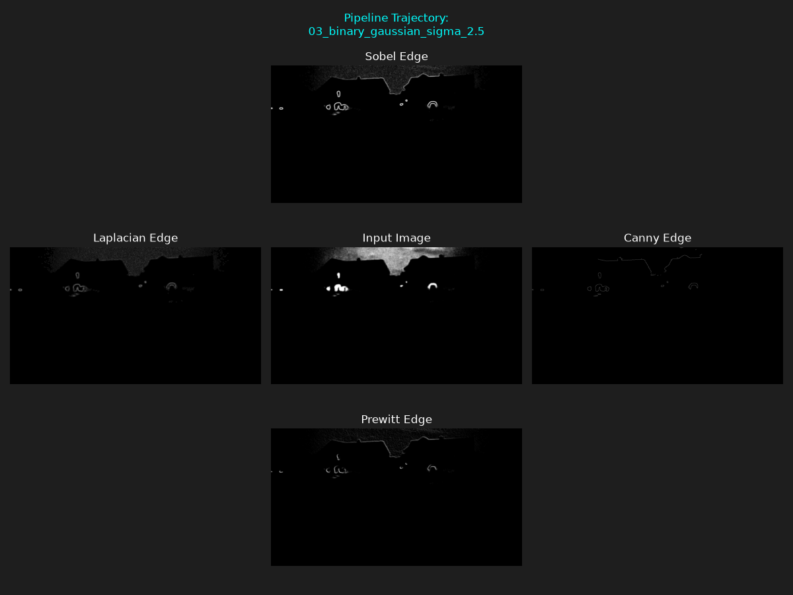
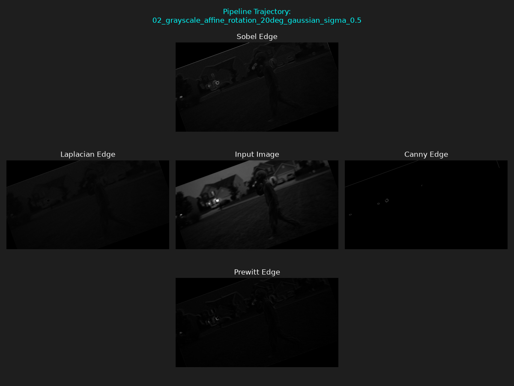
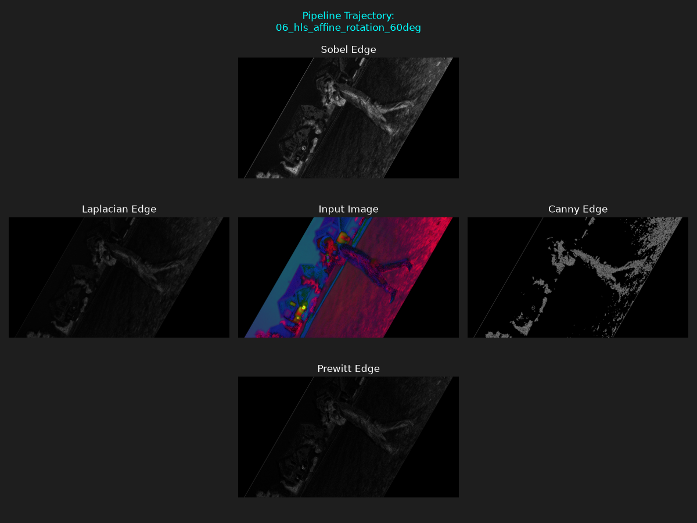
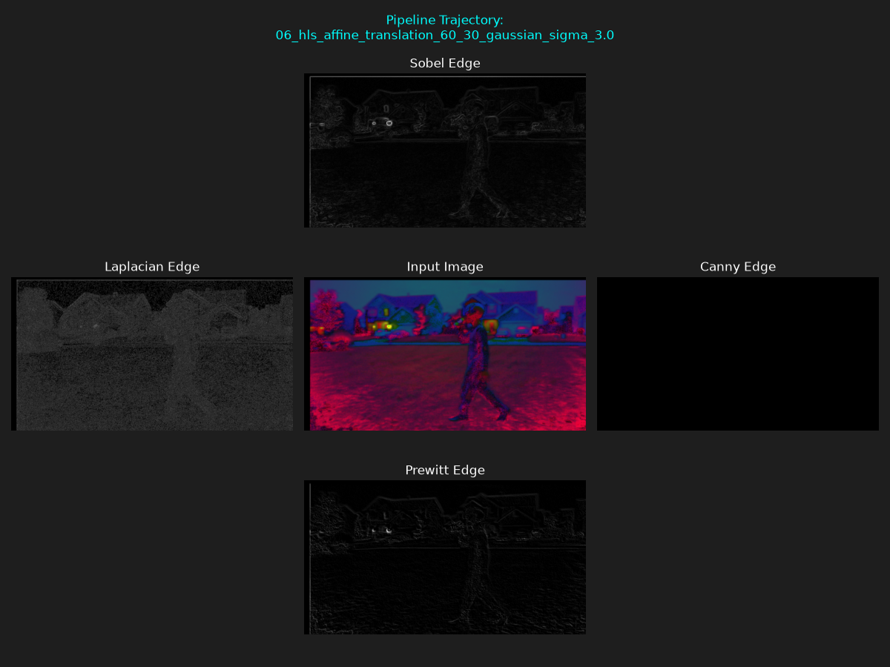

# CS898BA-Project1

## Libraries Used

- OpenCV
- NumPy
- Pandas
- SciPy
- Matplotlib

## Part 1: Image Statistics

Basic statistics were calculated for each RGB channel of the original image.

Statistics calculated:

- Minimum
- Maximum
- Mean
- Median
- Mode
- Skewness
- Range
- Standard Deviation
- Variance

Results were saved to:

```text
output/image_statistics.csv
```

### Observations

All three RGB channels showed positive skewness and moderate variation in pixel intensity values.

## Part 2: Image Processing Operations

### Grayscale Conversion

The original image was converted to grayscale.

### Binary Conversion

A threshold was applied to create a binary image.

### Color Space Conversions

The image was converted into:

- HSV
- CIELAB (LAB)
- HLS

### Histogram Equalization

Histogram equalization was performed on the V (Value) channel of the HSV image and then converted back to RGB.

### Affine Transformations

Two unique affine transformations were applied to each of the seven base images:

- Rotation
- Translation

This generated 14 transformed images.

### Gaussian Blur

Gaussian blur was applied to all 21 images using the following sigma values:

- 0.5
- 1.0
- 1.5
- 2.0
- 2.5
- 3.0
- 3.5

As the sigma value increased, the images became smoother and edge details became less visible.

This process generated a total of 168 images.

## Part 3: Edge Detection

The 168 generated images were randomly divided into four equal subsets.

Each subset contained:

```text
42 images
```

Subset 1 was selected for further analysis.

The following edge detection techniques were applied:

- Sobel
- Laplacian
- Canny
- Prewitt

Including the original input image, this produced:

```text
210 images
```

## Edge Detection Analysis

### Sobel

Advantages:

- Preserved major object boundaries
- Produced consistent results across different transformations
- Maintained useful structural information

Disadvantages:

- Some weaker edges were not detected
- Edge responses were occasionally thicker

### Laplacian

Advantages:

- Detected fine intensity changes
- Captured small image details

Disadvantages:

- More sensitive to noise
- Produced cluttered outputs in some cases

### Canny

Advantages:

- Produced thin and clean edges
- Reduced noise effectively

Disadvantages:

- Removed some useful image details
- Often produced sparse results after heavy blurring

### Prewitt

Advantages:

- Produced consistent edge maps
- Preserved major object structures

Disadvantages:

- Slightly weaker edge responses than Sobel
- Missed some finer details

### Best Performing Method

Based on the generated comparison plots, Sobel provided the most useful overall results for this image set.

Sobel consistently preserved the outline of the subject and surrounding structures while maintaining reasonable noise levels. Although Canny produced cleaner edges, it frequently removed useful information after transformations and Gaussian blurring. Laplacian introduced additional noise, while Prewitt produced similar results to Sobel but with slightly weaker edge responses.

For this image set, Sobel was selected as the best-performing edge detection method.

## Selected Comparison Plots

### Plot 1

Processing Pipeline:

HSV Equalization → Rotation (70°) → Gaussian Blur (σ = 3.0)



### Plot 2

Processing Pipeline:

Binary Image → Translation (30,15)



### Plot 3

Processing Pipeline:

Binary Image → Gaussian Blur (σ = 2.5)



### Plot 4

Processing Pipeline:

Grayscale → Rotation (20°) → Gaussian Blur (σ = 0.5)



### Plot 5

Processing Pipeline:

HLS → Rotation (60°)



### Plot 6

Processing Pipeline:

HLS → Translation (60,30) → Gaussian Blur (σ = 3.0)



## Conclusion

All required image processing operations, affine transformations, Gaussian blurring, subset generation, edge detection methods, and comparison plots were successfully completed. Based on the generated results, Sobel provided the most consistent edge detection performance for this image set.